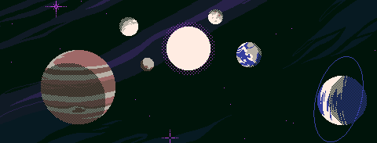

<h1 align="center">Alex Alves</h1>

🚀 <strong>DevOps, SRE | Docker, Kubernetes | Infraestrutura</strong> 
Analista SRE com experiência em ambientes críticos, atuando em confiabilidade, segurança e disponibilidade on-premise e em nuvem.

 
<h2 align="center">💼 O que eu faço</h2>

  
  
  
  
  
  
  
  
  

 

🌐 Automação IaC com **Terraform + Ansible**  
🐳 Containers & Kubernetes  
⚙️ Pipelines CI/CD  
📊 Observabilidade com Grafana, Zabbix & Prometheus  
💥 Resposta a incidentes & produção resiliente

 

<h2 align="center">📫 Contato</h2>

  

 
 
 

  

 

---

 

  

🪐 Love is the one thing we're capable of perceiving that transcends time and space 🪐

